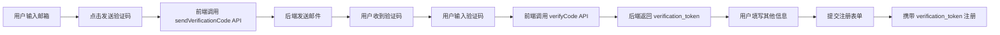
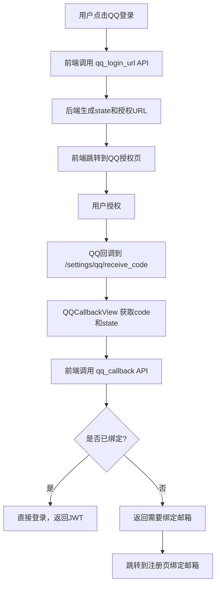

# 邮箱验证 & QQ登录完整流程说明

## 📋 整体架构

### 前后端分离架构
- **前端**: Vue 3 + Composition API (纯前端应用)
- **后端**: Django REST Framework (纯JSON API)
- **通信**: RESTful API + JWT Token认证
- **邮件模板**: 后端服务组件（用于生成邮件HTML，不影响前后端分离）

---

## 🔄 完整业务流程

### 一、邮箱注册验证流程

#### 1. 用户在前端注册页面 (`RegisterView.vue`)



#### 2. 后端API流程

**步骤1: 发送验证码** (`POST /api/v1/auth/send_verification_code/`)
```
前端 → AuthViewSet.send_verification_code()
  → 频率限制检查（邮箱5分钟3次，IP 1小时10次）
  → EmailVerificationCode.create_code() 生成验证码
  → send_verification_email() 发送邮件
  → 返回成功消息
```

**步骤2: 验证验证码** (`POST /api/v1/auth/verify_code/`)
```
前端 → AuthViewSet.verify_code()
  → 查找EmailVerificationCode记录
  → 验证是否有效（未使用 + 未过期）
  → 标记为已使用
  → 生成临时 verification_token（存缓存，5分钟有效）
  → 返回 verification_token 给前端
```

**步骤3: 用户注册** (`POST /api/v1/auth/register/`)
```
前端 → AuthViewSet.register()
  → RegisterSerializer.validate() 验证 verification_token
  → 从缓存获取token数据，验证邮箱和类型
  → User.objects.create_user() 创建用户
  → 标记 email_verified = True
  → 删除 verification_token（一次性使用）
  → 返回JWT token和用户信息
```

---

### 二、QQ登录流程

#### 1. QQ登录完整流程



#### 2. 后端API流程

**步骤1: 获取QQ登录URL** (`GET /api/v1/auth/qq_login_url/`)
```
前端 → AuthViewSet.qq_login_url()
  → generate_state() 生成随机state（CSRF防护）
  → get_qq_authorize_url() 生成QQ授权URL
  → 将state存入缓存（10分钟有效）
  → 返回URL和state给前端
```

**步骤2: QQ回调处理** (`POST /api/v1/auth/qq_callback/`)
```
前端 → AuthViewSet.qq_callback()
  → 验证state（从缓存检查，防CSRF）
  → get_qq_user_info_by_code() 获取QQ用户信息
  → 查找SocialAccount是否已绑定
  → 已绑定：直接登录，返回JWT
  → 未绑定：返回 need_bind_email=true，临时存储QQ信息
```

**步骤3: QQ账号绑定** (`POST /api/v1/auth/qq_bind/`)
```
前端 → AuthViewSet.qq_bind()
  → 验证邮箱验证码（通过verification_token）
  → 从缓存获取QQ临时信息
  → 检查邮箱是否已注册
  → 未注册：创建新用户 + 绑定QQ
  → 已注册：绑定QQ到现有账号
  → 返回JWT token
```

---

## 🔐 安全机制

### 1. 邮箱验证码安全
- ✅ **频率限制**: 同一邮箱5分钟内最多3次，同一IP 1小时内最多10次
- ✅ **有效期**: 验证码10分钟有效，验证token 5分钟有效
- ✅ **一次性使用**: 验证后立即标记为已使用，token只能使用一次
- ✅ **邮箱唯一性**: 注册时检查邮箱是否已被使用

### 2. QQ OAuth安全
- ✅ **CSRF防护**: 使用state参数，验证后立即删除（一次性）
- ✅ **Token安全**: 临时token存储在缓存中，有时间限制
- ✅ **账号唯一性**: 同一QQ只能绑定一个账号，同一邮箱只能绑定一个QQ

### 3. 数据保护
- ✅ **密码加密**: Django自动使用PBKDF2加密
- ✅ **JWT Token**: 使用SimpleJWT，支持刷新和黑名单
- ✅ **敏感信息**: 授权码存储在环境变量，不提交到Git

---

## 📁 文件组织结构

### 后端结构
```
trips/
├── models/
│   ├── email_verification.py  # 验证码模型
│   ├── social_auth.py         # QQ绑定模型
│   └── user_profile.py        # 用户资料模型（扩展邮箱验证字段）
├── serializers/
│   ├── auth_serializer.py     # 认证序列化器（验证码、QQ登录）
│   └── user_serializer.py     # 用户序列化器（注册需要verification_token）
├── api/viewsets/
│   └── auth_viewset.py        # 认证ViewSet（发送验证码、验证、QQ登录）
└── utils/
    ├── email_service.py       # 邮件发送服务
    ├── rate_limit.py          # 频率限制工具
    └── qq_oauth.py            # QQ OAuth工具函数
```

### 前端结构
```
web/src/
├── views/
│   └── auth/                  # 认证相关视图（已重组）
│       ├── LoginView.vue      # 登录页面（含QQ登录按钮）
│       ├── RegisterView.vue   # 注册页面（含邮箱验证码功能）
│       └── QQCallbackView.vue # QQ回调处理
├── api/
│   └── auth.js                # 认证API（sendVerificationCode, verifyCode, QQ相关）
└── router/
    └── index.js               # 路由配置（已更新路径）
```

---

## 🎯 关键数据流

### 验证码生成与验证
```
1. 用户输入邮箱 → send_verification_code
2. 后端生成6位数字验证码 → 存入EmailVerificationCode表
3. 发送邮件（开发环境：控制台；生产环境：SMTP）
4. 用户输入验证码 → verify_code
5. 验证通过 → 生成verification_token（32位随机字符串，存缓存5分钟）
6. 用户注册 → 携带verification_token
7. 验证token → 创建用户 → 标记邮箱已验证 → 删除token
```

### QQ登录数据流
```
1. 获取登录URL → 生成state → 存储到缓存
2.倍 QQ授权 → 返回code和state
3. 验证state（防止CSRF）→ 用code换取access_token
4. 用access_token获取openid和用户信息
5. 查询SocialAccount → 已绑定直接登录，未绑定要求绑定邮箱
6. 绑定邮箱 → 创建/关联账号 → 返回JWT
```

---

## ⚙️ 配置说明

### 环境变量（.env文件）
```env
# 邮件配置
USE_REAL_EMAIL=1  # 开发环境设为0使用控制台，1使用真实SMTP
EMAIL_HOST=smtp.qq.com
EMAIL_PORT=587
EMAIL_HOST_USER=your_email@qq.com
EMAIL_HOST_PASSWORD=your_authorization_code

# QQ OAuth
QQ_APP_ID=102813859
QQ_APP_KEY=OddPvLYXHo69wTYO
QQ_REDIRECT_URI=https://app7508.acapp.acwing.com.cn/settings/qq/receive_code
```

---

## 🐛 常见问题

### 1. 验证码未收到
- 开发环境：检查Django服务器控制台输出
- 生产环境：检查邮箱配置是否正确，授权码是否有效

### 2. QQ登录失败
- 检查回调地址是否与QQ开发者平台配置一致
- 检查APP ID和APP Key是否正确
- 检查state参数验证是否通过

### 3. 注册时报验证token错误
- 确保先完成邮箱验证（获取verification_token）
- 验证token有效期5分钟，需及时提交注册

---

## ✅ 测试检查清单

- [ ] 发送验证码成功（控制台可见或邮箱收到）
- [ ] 验证码验证成功，获得verification_token
- [ ] 使用verification_token注册成功
- [ ] 注册时验证token验证（邮箱匹配、类型匹配）
- [ ] QQ登录URL获取成功
- [ ] QQ授权回调正确处理
- [ ] QQ账号绑定流程完整
- [ ] 频率限制正常工作

